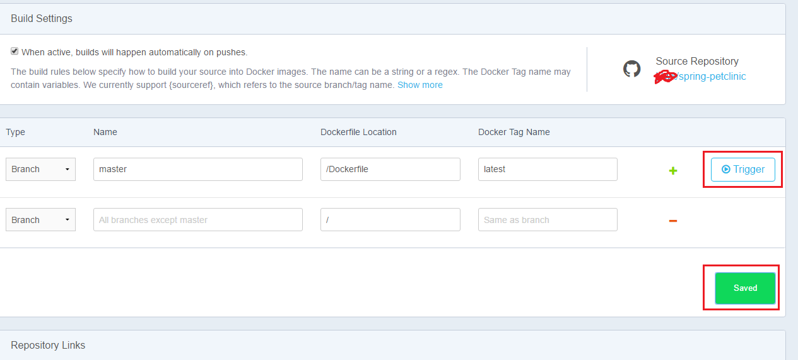
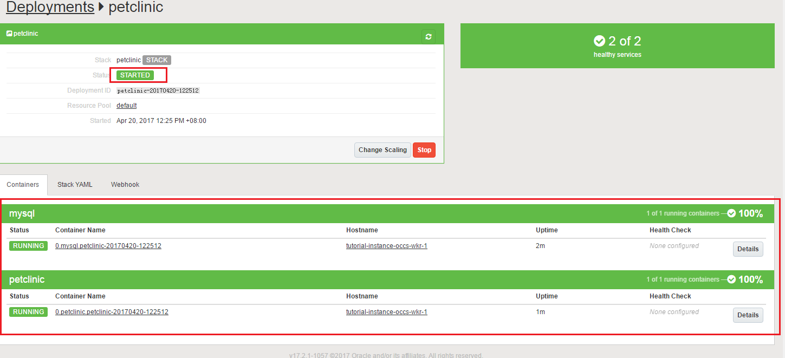
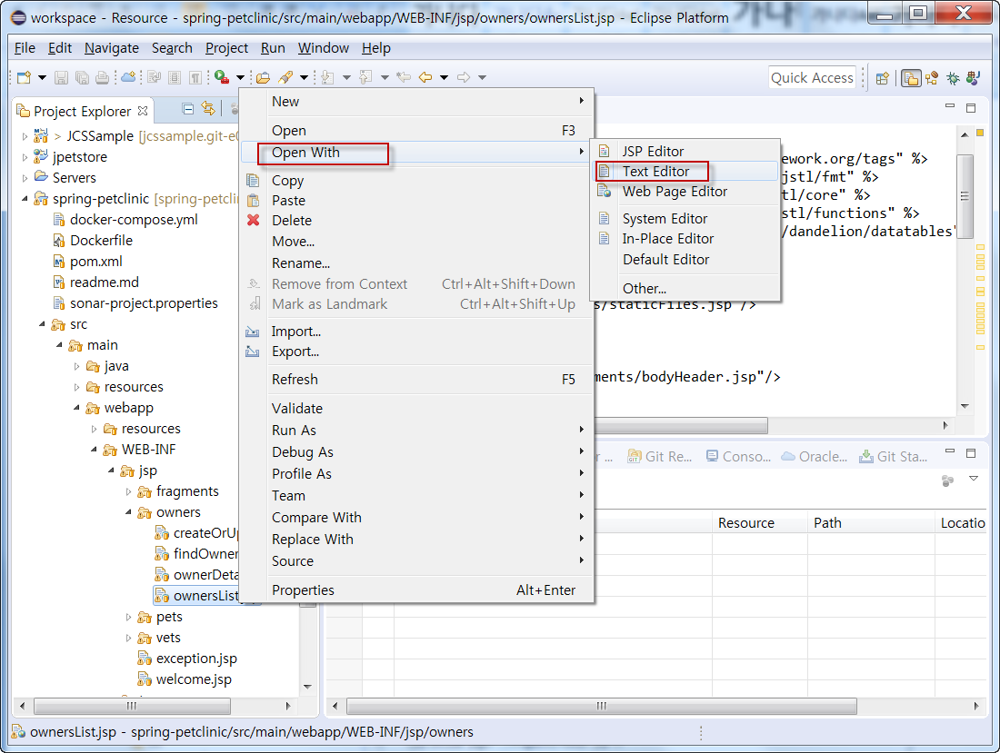
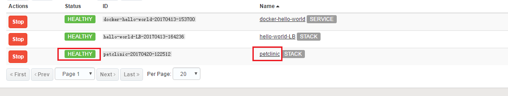
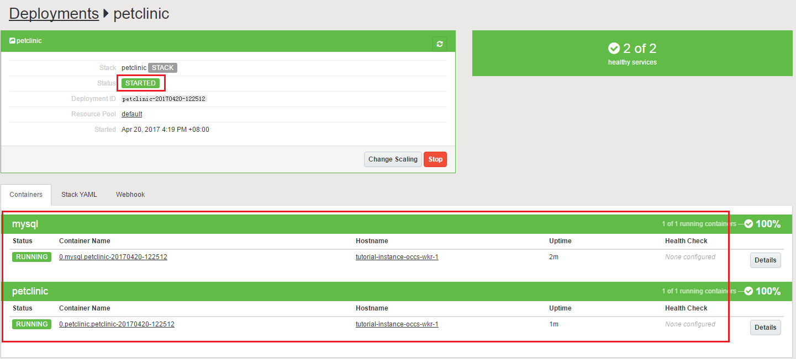

[./media/image1.png](./media/image1.png)
========================================

Lab 500

Oracle Public Cloud Workshop
============================

Container Cloud Service Hands-on Guide
======================================

*OCCS상의 오픈소스 개발 환경 구축*
==================================

-   Zhu Dong (<dong.zhu@oracle.com>), Ke Wang (<ke.w.wang@oracle.com>)

May 17, 2017

Introduction 
-------------

이 튜토리얼은 GitHub 오픈소스 프로젝트인 Petclinic에 기반한 웹 애플리케이션 스택
데모 빌드를 어떻게 하는지를 보여줍니다.

### Objectives

-   GitHub 내의 spring-petclinic 을 새로운 브랜치로 Fork해서 Docker hub로
    가져온다.

-   OCCS의 Stack을 이용해서 빌드:  spring-petclinic(tomcat) + MySQL

-   Eclipse 환경을 구성하고 GitHub 리포지토리로부터 로컬로 프로젝트를 복제한다

-   Eclipse 내의 petclinic 소스코드를 수정해서 commit/push 기능을 통해서
    GitHub에 있는 소스 코드를 업데이트 한다.

-   Docker 이미지가 자동적으로 빌드되고 OCCS내에서 소스 코드가 수정이 되어
    있는지 확인한다

### Required Artifacts 

Oracle Container Cloud Service를 사용하기 전:

귀하 혹은 귀하의 조직 누군가는 Oracle Container Cloud Service 트라이얼 이나 가입
신청을 해서 사용할 수 있도록 활성화해야만 합니다.

좀더 많은 정보를 원한다면, Oracle Help Center내의 Using [Oracle Container Cloud
Service](http://docs.oracle.com/cloud/latest/container-cloud/CONTU/toc.htm) 에서
확인합니다.

GitHub 계정: 당신이 GitHub 계정을 가지고 있지 않다면, <https://github.com/> 에
접속해서Sign up을 해야 합니다.

Docker Hub 계정: 당신이Docker Hub 계정을 가지고 있지 않다면, Sign up을 위해
[https://hub.docker.com/](https://hub.docker.com/login) 에 접속합니다.

### Outline

[Introduction 2](#introduction)

[Objectives 2](#objectives)

[Required Artifacts 2](#required-artifacts)

[Outline 3](#outline)

[Fork a new branch based on spring-petclinic in GitHub and Dockerrize it
4](#fork-a-new-branch-based-on-spring-petclinic-in-github-and-dockerrize-it)

[Build a new stack in OCCS:  spring-petclinic(tomcat) + MySQL
22](#build-a-new-stack-in-occs-spring-petclinictomcat-mysql)

[Configure an Eclipse environment and clone the project repository from GitHub
to local
30](#configure-an-eclipse-environment-and-clone-the-project-repository-from-github-to-local)

[Modify the source code of the petclinic in Eclipse and commit/push the changes
to GitHub
44](#modify-the-source-code-of-the-petclinic-in-eclipse-and-commitpush-the-changes-to-github)

[Confirm the Docker image automatically building and check the code modification
result in OCCS.
49](#confirm-the-docker-image-automatically-building-and-check-the-code-modification-result-in-occs.)

Fork a new branch based on spring-petclinic in GitHub and Dockerrize it
-----------------------------------------------------------------------

1.  브라우저를 열고 해당 URL로 <https://github.com/login> 접속하여 당신의 Github
    계정을 사용해서 로그인 합니다.

1.  <https://github.com/stagemonitor/spring-petclinic> 주소로 접속해서 , “Fork”
    버튼 클릭

1.  “Create new file”을 클릭하고 아래 라인을 복사해서 붙인다, 파일이름은
    “Dockerfile”로 한다.

FROM tutum/tomcat

RUN rm -rf /tomcat/webapps/\*

\#install maven and git to build project

RUN apt-get update && apt-get install -y wget git-core maven

RUN mkdir /opt/aspectj && cd /opt/aspectj &&\\

wget -O aspectjweaver-1.8.2.jar
http://search.maven.org/remotecontent?filepath=org/aspectj/aspectjweaver/1.8.2/aspectjweaver-1.8.2.jar

\#ADD ./setenv.sh /tomcat/bin/setenv.sh

ENV CATALINA_OPTS="\$CATALINA_OPTS
-javaagent:/opt/aspectj/aspectjweaver-1.8.2.jar"

\# Pull petclinic

RUN git clone https://github.com/**\<account_id\>**/spring-petclinic.git

\# Build petclinic

WORKDIR /spring-petclinic

\#RUN rm src/main/resources/stagemonitor.properties

\#ADD ./stagemonitor.properties
/spring-petclinic/src/main/resources/stagemonitor.properties

RUN mvn -Dmaven.test.skip=true package &&\\

mv /spring-petclinic/target/petclinic.war /tomcat/webapps/petclinic.war &&\\

rm -rf /spring-petclinic

1.  “Commit new file” 클릭 .

1.  “pom.xml” 클릭

1.  펜슬 아이콘의 편집모드를 클릭

>   [./media/image9.png](./media/image9.png)

1.  다음 지정된 위치를 찾아가서, “hsqldb” 파트를 주석 처리하고 “mysql” 파트의
    주석을 푼다.

1.  변경된 내용 저장을 위해 “Commit changes” 클릭.

1.  다음 경로 “spring-petclinic/src/main/resources/spring/”로 변경, 그러면
    “data-accesss.properties”을 볼 수 있다.

1.  “data-access.properties” 파일 클릭.

1.  편집 모드로 들어가기 위해 펜슬 아이콘 클릭.

1.  다음 내용이 있는 파일을 수정.

1.  변경 사항을 적용하기 위해 “Commit changes” 클릭.

2.  새로운 브라우저 탭을 오픈해서 <https://hub.docker.com/>에 접속하여
    당신의docker hub 계정에 로그인 한다.

1.  TOP 메뉴에 있는 “Create”를 클릭하고 “Create Automated Build”를 선택한다.

1.  Github에서 가져올 것이기 때문에 왼쪽 해당부분을 클릭.

1.  “spring-petclinic” 클릭 .

1.  Short description 필드에 “spring-petclinic-docker” 입력 후 , “Create” 클릭.

1.  “Build Settings” 클릭, Dockerfile Location필드에 “/Dockerfile” 입력.

1.  “Save Changes” 클릭

1.  이제 Docker 이미지 구축을 위한 준비 작업이 완료되었습니다, “Trigger”를
    클릭하여 발동 조치를 하십시오

1.  Building 경과를 모니터링 하기 위해서 “Build Details”클릭.

1.  진행 사항 확인을 위해 “F5”를 누르면 Building 업무의 상태가 몇 분 후
    “Success”로 변경된다.

1.  결과 체크를 위해 “Tags” 클릭.

우리는 “spring-petclinic” 프로젝트의 Docker 이미지의 최신 버전을 얻는다.

Build a new stack in OCCS:  spring-petclinic(tomcat) + MySQL
------------------------------------------------------------

1.  OCCS 인스턴스 콘솔을 열고, “Stacks”을 클릭 그리고 “New Stack” 버튼을 클릭.

[./media/image29.png](./media/image29.png)
------------------------------------------

1.  “Advanced Editor” 클릭해서 “Docker Compose” 포맷과 유사한 YAML Stack
    editor를 띄운다.

1.  아래 내용을 복사, 붙여 넣기 한다.

    version: 2

    services:

    mysql:

    image: mysql

    ports:

    \- '3306:3306/tcp'

    environment:

    \- MYSQL_ROOT_PASSWORD=petclinic

    \- MYSQL_DATABASE=petclinic

    petclinic:

    image: \<docker_hub_account_id\>/spring-petclinic

    links:

    \- 'mysql:db'

    ports:

    \- '8888:8080/tcp'

    

2.  “Done” 클릭，그런 후에 Stack 이름은 “petclinic”으로 입력한다.

[./media/image33.png](./media/image33.png)
------------------------------------------

1.  정의된 Stack을 완료하기 위해 “Save” 클릭.

1.  Petclinic애플리케이션 인스턴스를 배포하기 위해 “Deploy”를 클릭, Stack
    인스턴스에 대해서 Default 파라미터 유지.

1.  “Deploy” 클릭, 진행상태 바에서 Stack 인스턴스의 두 개의 container가 생성되는
    것을 보여줍니다.

2.  1분이 안 되는 시간에 완료된다

Petclinic 컨테이너가 생성되는 동안에, 초기 로직이 데이터베이스 스키마 빌딩
작업을 수행할거고, 몇 몇 데이터베이스 객체들이 생성되고 샘플 데이터 역시 임포트
될 예정입니다.

1.  접속 공인 IP를 알아내기 위해 “hostname”을 클릭.

1.  브라우저 탭을 열어서, 해당 URL: 접속 .

1.  “Find owners” 클릭

1.  “Find Owner” 클릭, 조건이 없는 애완동물과 소유주 정보가 나열 될 것 입니다..

검색 텍스트 상자에 원하는 결과 집합을 필터링하는 키워드를 입력 할 수 있습니다.

Configure an Eclipse environment and clone the project repository from GitHub to local
--------------------------------------------------------------------------------------

이클립스는 개발자에게 매우 인기있는 IDE툴이다, GitHub 역시 이클립스와 쉽게
연계할 수 있다, 이번 랩에선, 우리는 이클립스를 통해 애플리케이션 소스코드를
수정하고 새로운 버전의 코드로 커밋하는 방법을 배울 것이다

1.  당신이 이클립스 환경을 가지고 있지 않다면, 다음 경로에서 다운로드 받을 수
    잇습니다.:

>   <http://www.oracle.com/technetwork/developer-tools/eclipse/downloads/index.html>

1.  인스톨 완료 후에, 이클립스를 실행합니다.

1.  “Help-Eclipse Marketplace” 클릭

1.  “egit” 입력후“Go” 클릭

1.  Confirm the status of “EGit” 가 “Installed” 되어있는지 확인 후에 설치가
    안되어 있으면 “Install”을 클릭해서 설치하도록 한다, 이러한 과정이 끝난 후
    대화창을 종료한다

1.  이클립스 File 메뉴의 “Import” 클릭

1.  “Projects from Git” 클릭.

1.  “Next” 클릭 , 그런 후에 “Clone URI” 선택.

1.  “Next” 클릭.

1.  Github 웹사이트로 돌아가서, 당신의 GitHub 계정으로 로그인 합니다. 이전
    스텝에서 우리는 “spring-petclinic”이라 불리는 프로젝트를 fork 하였습니다. 이
    저장소에 접근하기 위해 우리는
    [https://github.com/\<account_id\>/spring-petclinic](https://github.com/%3caccount_id%3e/spring-petclinic)을
    타이핑 할 것 입니다.

1.  “Clone or download” 클릭.

1.  주소 링크 복사를 위해서 카메라 아이콘을 클릭

1.  Eclipse IDE로 돌아가서, "URI"항목에 커서를 놓고 마우스 오른쪽 버튼을
    클릭하여 여기에 링크를 붙여 넣으면 "호스트"와 "저장소 경로"가 자동으로
    채워집니다. "인증"부분에서 수동으로 설정해야합니다.

“Next” 클릭,

1.  “Next” 클릭, “Directory” 텍스트 박스에 적절한 경로를 설정하세요

1.  “Next”클릭,“Import as general project” 선택.

1.  “Next” 클릭, ㅌ\`프로젝트 이름을 리뷰하고 클론 작업을 마무리 하기 위해
    “Finish” 클릭

Modify the source code of the petclinic in Eclipse and commit/push the changes to GitHub
----------------------------------------------------------------------------------------

1.  좌측 패인내의 트리를 확장하여 “ownersList.jsp”를 찾아낸다

    

2.  “ownersList.jsp” 파일에 마우스 오른쪽 버튼 클릭하여 “Text Editor “을
    이용해서 파일을 오픈한다.

1.  스크롤바를 내려서, 다음 라인에 커서를 위치 시킨다.

1.  Modify the line 33 and 35 with the following content.

1.  변경 내용을 저장하기 위에 저장 아이콘 클릭

1.  왼쪽 패인의 루트 노드를 마우스 오른쪽 클릭

    

“Commit” 클릭

1.  텍스트 박스 안에 “Code modification” 입력.

1.  “Commit and Push…” 클릭

1.  “OK”클릭, 머지 않아 코드 업그레이드가 끝날것이다..

Confirm the Docker image automatically building and check the code modification result in OCCS.
-----------------------------------------------------------------------------------------------

1.  hub.docker.com로 돌아가서, 당신의 계정으로 로그인 합니다, 우리는 아래 URL에
    접속해서 자동적으로 Docker image가 리빌딩 되는 결과를 확인할 것입니다.
    [https://hub.docker.com/r/\<docker_hub_account_id\>/spring-petclinic/builds/](https://hub.docker.com/r/%3cdocker_hub_account_id%3e/spring-petclinic/builds/)
    ”  
    우리는 빌딩 작업이 실행 준비 상태인 것을 확인 할 수 있습니다.

1.  몇 분후, 빌딩 작업이 “Success” 상태가 됨을 확인합니다.

1.  OCCS 콘솔로 돌아가서, 좌측 패인의 “Deployments”를 클릭.

1.  petclinic 애플리케이션 stack을 stop합니다..

1.  stack이 stopped된 후 시작하기 위해 “Start”를 클릭.

1.  “petclinic”를 클릭해서 디테일하게 체크합니다.

    

2.  모든 컨테이너가 정상적으로 구동이 되었다고 보이면 브라우저 탭을 열고 아래
    URL을 입력해서 접속합니다.

“Find owners” 클릭

1.  명백히, 페이지는 우리에게 새로운 내용을 보여주고 있습니다. 여기까지 잘
    되었으면 이 Lab은 성공적으로 완료 되었음을 의미합니다.
